<div align="center">

<!-- Animated Hero Banner — adapts to dark/light mode -->
<picture>
  <source media="(prefers-color-scheme: dark)" srcset=".github/assets/hero-dark.svg">
  <source media="(prefers-color-scheme: light)" srcset=".github/assets/hero-light.svg">
  
</picture>

<br>

<!-- Animated typing effect -->
<a href="https://github.com/public-apis/public-apis">
  
</a>

<br><br>

<!-- Animated badge row -->
[](https://github.com/public-apis/public-apis)
[](https://beko2210.github.io/API_directory)
[](https://opensource.org/licenses/MIT)

</div>

<br>

<!-- Animated Tech Stack — dark/light mode -->
<picture>
  <source media="(prefers-color-scheme: dark)" srcset=".github/assets/tech-stack-dark.svg">
  <source media="(prefers-color-scheme: light)" srcset=".github/assets/tech-stack-light.svg">
  
</picture>

<br>

<!-- Animated Features Grid — dark/light mode -->
<picture>
  <source media="(prefers-color-scheme: dark)" srcset=".github/assets/features-dark.svg">
  <source media="(prefers-color-scheme: light)" srcset=".github/assets/features-light.svg">
  
</picture>

<br>

<!-- Animated Architecture Flow — dark/light mode -->
<picture>
  <source media="(prefers-color-scheme: dark)" srcset=".github/assets/architecture-dark.svg">
  <source media="(prefers-color-scheme: light)" srcset=".github/assets/architecture-light.svg">
  
</picture>

<br>

> [!NOTE]
> This project is a **visual frontend** for the amazing [**public-apis/public-apis**](https://github.com/public-apis/public-apis) repository. All API data originates from their community-curated collection. To add or update an API, please contribute directly to the [original repository](https://github.com/public-apis/public-apis).

---

<details>
<summary><strong>&nbsp;Quick Start</strong></summary>

<br>

```bash
git clone https://github.com/BEKO2210/API_directory.git
cd API_directory
pnpm install
pnpm run fetch   # Download latest API data from public-apis
pnpm dev          # Start dev server at localhost:4321
```

```bash
pnpm build        # Production build (1,481 static pages)
pnpm preview      # Preview production build locally
```

</details>

<details>
<summary><strong>&nbsp;Deploy to GitHub Pages</strong></summary>

<br>

| Step | Action |
|:-----|:-------|
| **1** | Fork this repository |
| **2** | Go to **Settings** → **Pages** → Source: **GitHub Actions** |
| **3** | Push to `main` — the deploy workflow runs automatically |
| **4** | Your site is live at `https://<user>.github.io/API_directory` |

> [!TIP]
> For a custom domain, update `site` and `base` in `astro.config.mjs` and add a `CNAME` file in `public/`.

</details>

<details>
<summary><strong>&nbsp;Project Structure</strong></summary>

<br>

```
├── .github/workflows/     # CI/CD: deploy, daily sync, lighthouse
├── public/                # Static assets, PWA icons, manifest
├── scripts/               # Data fetching from public-apis
├── src/
│   ├── components/        # Astro components (Header, APICard, FilterBar...)
│   ├── data/              # apis-cache.json (1,424 APIs), category icons
│   ├── layouts/           # Base, Page, CategoryLayout
│   ├── lib/               # TypeScript: types, utils, getApis, parseApis
│   ├── pages/             # File-based routing (51 categories, 1,424 API pages)
│   └── styles/            # Design tokens, global CSS
└── astro.config.mjs       # Astro + Tailwind v4 + Sitemap + Compress
```

</details>

<details>
<summary><strong>&nbsp;Daily Data Sync</strong></summary>

<br>

The [`sync-apis.yml`](.github/workflows/sync-apis.yml) workflow runs every day at **03:00 UTC**:

1. Fetches the latest [`README.md`](https://github.com/public-apis/public-apis/blob/master/README.md) from **public-apis/public-apis**
2. Parses all markdown tables into structured JSON
3. Commits changes to `apis-cache.json` if data has changed
4. Triggers a rebuild and redeploy automatically

> [!IMPORTANT]
> The data sync depends entirely on [public-apis/public-apis](https://github.com/public-apis/public-apis). If you want to add an API, submit a PR to their repository — it will appear here within 24 hours.

</details>

<details>
<summary><strong>&nbsp;Categories</strong></summary>

<br>

<table>
<tr><td>Animals</td><td>Anime</td><td>Anti-Malware</td><td>Art & Design</td></tr>
<tr><td>Authentication</td><td>Blockchain</td><td>Books</td><td>Business</td></tr>
<tr><td>Calendar</td><td>Cloud Storage</td><td>Continuous Integration</td><td>Cryptocurrency</td></tr>
<tr><td>Currency Exchange</td><td>Data Validation</td><td>Development</td><td>Dictionaries</td></tr>
<tr><td>Documents</td><td>Email</td><td>Entertainment</td><td>Environment</td></tr>
<tr><td>Events</td><td>Finance</td><td>Food & Drink</td><td>Games & Comics</td></tr>
<tr><td>Geocoding</td><td>Government</td><td>Health</td><td>Jobs</td></tr>
<tr><td>Machine Learning</td><td>Music</td><td>News</td><td>Open Data</td></tr>
<tr><td>Open Source</td><td>Patent</td><td>Personality</td><td>Phone</td></tr>
<tr><td>Photography</td><td>Programming</td><td>Science & Math</td><td>Security</td></tr>
<tr><td>Shopping</td><td>Social</td><td>Sports & Fitness</td><td>Test Data</td></tr>
<tr><td>Text Analysis</td><td>Tracking</td><td>Transportation</td><td>URL Shorteners</td></tr>
<tr><td>Vehicle</td><td>Video</td><td>Weather</td><td><em>+ more</em></td></tr>
</table>

> [!TIP]
> Full category list sourced from [public-apis/public-apis](https://github.com/public-apis/public-apis#index).

</details>

---

<div align="center">

### This project visualizes data from

<a href="https://github.com/public-apis/public-apis">
  
</a>

<br><br>

**All API data belongs to the [public-apis](https://github.com/public-apis/public-apis) community.**<br>
Want to add your API? [Contribute to the original repo →](https://github.com/public-apis/public-apis/blob/master/CONTRIBUTING.md)

<br>

<sub>Built with Astro, Tailwind CSS v4, TypeScript, and Pagefind. Licensed under MIT.</sub>

</div>
